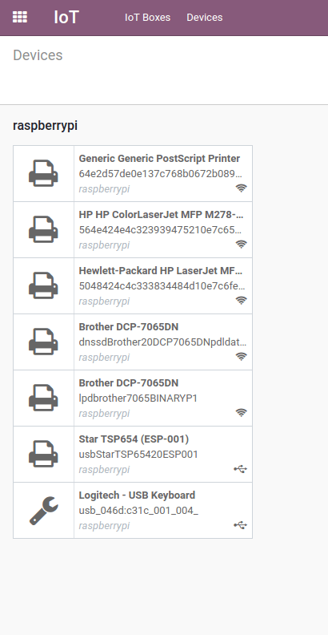

=================
Connect a printer
=================

A printer can be attached to the :abbr:`IoT (Internet of Things)` box on an Odoo database.
Installation is easy and convenient and can be done in a few easy steps. The printer can be used to
print receipts, orders or even reports from the different Odoo apps. In addition printer actions can
be assigned as an action on a trigger during the manufacturing process.

Connection
==========

The :abbr:`IoT (Internet of Things)` box supports printers connected through :abbr:`USB (Universal
Serial Bus)`, network connection or Bluetooth. `Supported printers
<https://www.odoo.com/page/iot-hardware>`__ will be detected automatically and will appear in the
:guilabel:`Devices` list of the :menuselection:`IoT` app.

.. image:: printer/printer-detected.png
   :align: center
   :alt: The printer as it would appear in the IoT app devices list.

.. note::
   The printer can take up to two minutes to appear in the :menuselection:`IoT` app devices list.

Link the printer
================

Link a printer to a work center in the manufacturing app
--------------------------------------------------------

To link the printer to an action, it needs to be configured on a *work center*. Navigate to
:menuselection:`Manufacturing --> Configuration --> Work Centers`. Go to the :guilabel:`Work Center`
the printer will be used in and add the device in the :guilabel:`IoT Triggers` tab under
:guilabel:`Device` by selecting :guilabel:`Add a Line`. Then, it can be linked to either of the
following actions :guilabel:`Actions`: :guilabel:`Print Labels`, :guilabel:`Print Operation`, or
:guilabel:`Print Delivery Slip`. A key can be added to trigger the action.

It should be noted that the trigger that is first in the list will be chosen first. So, the order
matters and these triggers can be dragged into order.

.. note::
   On the :guilabel:`work order` screen, a status graphic indicates whether the database is
   correctly connected to the printer.

Link the printer to reports
---------------------------

It's also possible to link a type of report to a certain printer. In the :menuselection:`IoT` app,
go to the :menuselection:`Devices` menu and select the printer that needs to be configured.

Now, go to the :guilabel:`Printer Reports` tab. :guilabel:`Edit` the page and select :guilabel:`Add
a line`. In the window that appears, check all the types of :guilabel:`Reports` that should be
linked to this printer.

Now, each time :guilabel:`Print` is selected in the control panel, instead of downloading a PDF,
Odoo will send the report to the selected printer and automatically print it.

.. seealso::
   :doc:`POS Order Printing <../../../sales/point_of_sale/restaurant/kitchen_printing>`

.. note::
   Reports can also be configured in the :guilabel:`Technical Menu` while in :ref:`debug mode
   <developer-mode>`. Navigate to :menuselection:`Settings App --> Technical Menu --> Actions -->
   Reports`. The individual report can be found in this list, where the :guilabel:`IOT Device` can
   be set on the report.
